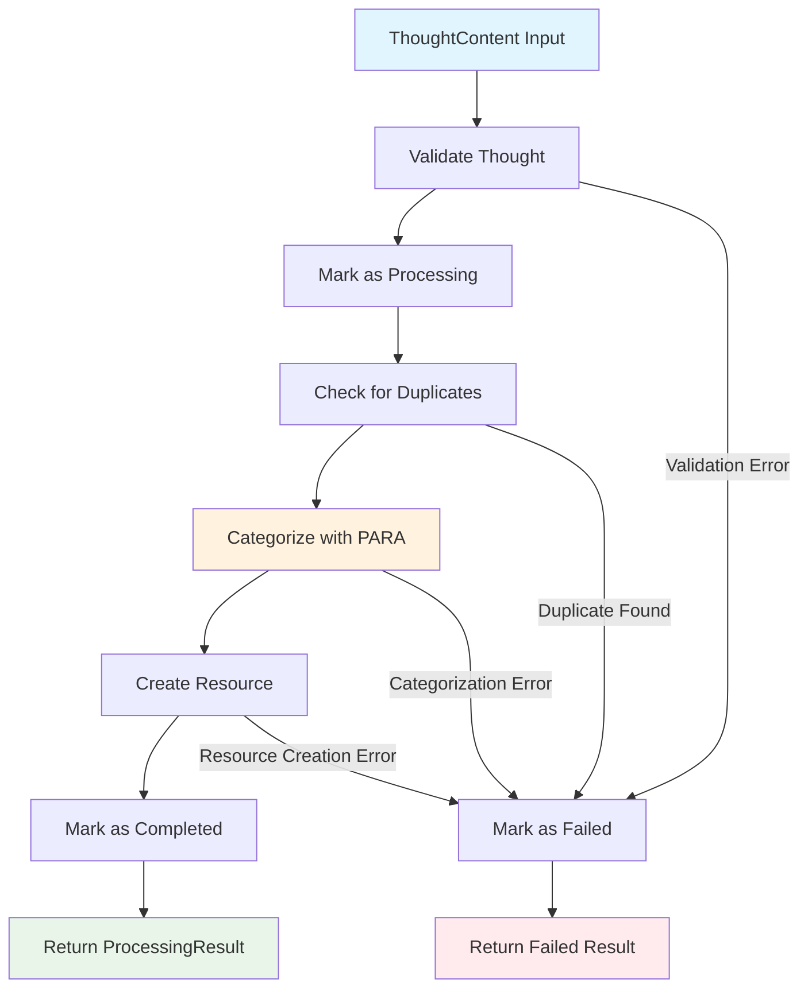
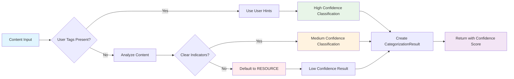
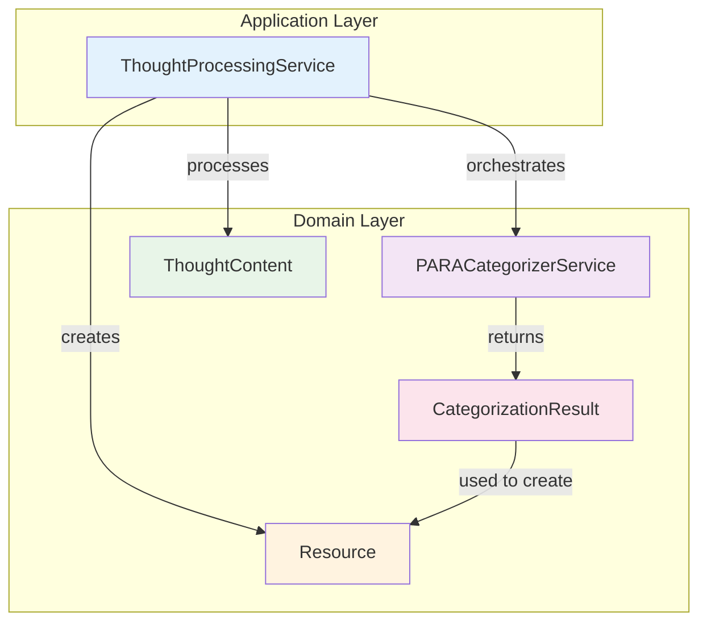

# ParaFlow
AI-powered personal assistant that captures, processes, and organizes your thoughts into the PARA framework

## Overview

ParaFlow helps you maintain an organized PARA (Projects, Areas, Resources, Archives) system by automatically scanning, updating, and reorganizing your content. While initially designed for Notion integration, ParaFlow is built to be extensible for other platforms and use cases.

## What is PARA?

PARA is a productivity method that organizes information into four categories:
- **Projects**: Things with a deadline and specific outcome
- **Areas**: Ongoing responsibilities to maintain
- **Resources**: Topics of ongoing interest
- **Archives**: Inactive items from the other three categories

## The Challenge

Maintaining a PARA system requires constant manual updates:
- Moving completed projects to archives
- Reorganizing resources as interests evolve
- Keeping area documentation current
- Ensuring easy access to relevant information

## The Solution

ParaFlow automates this process by:
- Scanning your workspace for content changes
- Receiving webhooks for real-time updates
- Automatically categorizing and reorganizing content
- Maintaining consistent structure across your PARA system
- Providing organic ways to update and extract information

## Features (Planned)

- **Automated Scanning**: Periodically scans your workspace for changes
- **Webhook Integration**: Receives real-time updates
- **Intelligent Categorization**: Automatically moves content between PARA categories
- **Smart Organization**: Maintains consistent structure and naming conventions
- **Easy Information Extraction**: Provides streamlined access to your organized content
- **Deployable**: Can be deployed as a service to run continuously
- **Extensible**: Built to support multiple platforms beyond Notion

## Getting Started

### Installation

```bash
# Clone the repository
git clone https://github.com/dkoenawan/ParaFlow.git
cd ParaFlow

# Create virtual environment
python3 -m venv venv
source venv/bin/activate  # On Windows: venv\Scripts\activate

# Install dependencies
pip install -e .
```

### Development Setup

```bash
# Install development dependencies
pip install -e ".[dev]"

# Run tests
python -m pytest packages/domain/tests/

# Run type checking
mypy packages/
```

### Current Implementation Status

**✅ Completed:**
- Core domain model for thought streaming and resource management
- ThoughtContent entity with immutable design and lifecycle management
- Resource entity for PARA methodology organization
- Processing status lifecycle management (NEW → PROCESSING → COMPLETED/FAILED)
- Type-safe value objects (ThoughtId, ContentText, ResourceId, ResourceTags)
- PARACategorizerService for content classification (placeholder with future-ready interface)
- ThoughtProcessingService for orchestrating complete thought-to-resource workflow
- Comprehensive domain services with hexagonal architecture design
- Extensive test suite (100+ tests) with high code coverage
- Monorepo package structure with clean separation of concerns

**🚧 In Progress:**
- Domain Events implementation for processing lifecycle events
- Infrastructure layer implementation
- API endpoints for thought capture and processing

**📋 Planned:**
- Advanced LLM-based categorization with personal context awareness
- Notion integration for workspace automation
- Webhook support for real-time updates
- Automated content scanning and reorganization

## Architecture

ParaFlow follows hexagonal architecture (Ports & Adapters) and domain-driven design principles:

### Domain Model

The core domain model includes:

**Entities:**
- **`ThoughtContent`**: Main entity representing user thoughts with free-form content and processing lifecycle
- **`Resource`**: Entity representing organized content within PARA methodology framework

**Value Objects:**
- **`ThoughtId`**: Type-safe unique identifier for thoughts
- **`ResourceId`**: Type-safe unique identifier for resources
- **`ContentText`**: Value object for validated content with length management
- **`ResourceTags`**: Value object for managing resource tags with validation
- **`ProcessingStatus`**: Enum managing thought processing lifecycle (NEW → PROCESSING → COMPLETED/FAILED)
- **`PARACategory`**: Enum for PARA methodology categories (PROJECT/AREA/RESOURCE/ARCHIVE)

**Services:**
- **`ThoughtProcessingService`**: Application service orchestrating complete thought-to-resource transformation
- **`PARACategorizerService`**: Domain service for intelligent content classification using PARA methodology

Key design principles:
- **Immutable entities**: All domain objects are frozen dataclasses
- **Type safety**: Strong typing with native Python union types
- **Business rules**: Domain logic enforced at entity level
- **Hexagonal architecture**: Clear separation between domain logic and external concerns
- **No length limits**: Supports seamless thought streaming

### Service Architecture

#### ThoughtProcessingService Workflow

The ThoughtProcessingService orchestrates the complete thought-to-resource transformation workflow:



#### PARA Categorization Process

The PARACategorizerService classifies content according to PARA methodology:



#### Service Interaction Overview



### Package Structure

```
packages/
├── domain/                 # Core domain layer
│   ├── models/            # Domain entities and value objects
│   │   ├── thought_content.py
│   │   ├── resource.py
│   │   ├── categorization_result.py
│   │   ├── processing_status.py
│   │   ├── para_category.py
│   │   └── ...           # Other value objects
│   ├── services/          # Domain services
│   │   ├── thought_processing_service.py
│   │   └── para_categorizer_service.py
│   └── tests/             # Comprehensive test suite (100+ tests)
│       ├── services/      # Service tests
│       ├── test_*.py      # Model tests
│       └── ...
├── infrastructure/        # External integrations (planned)
└── application/          # Use cases and API layer (planned)
```

## Contributing

This is an open source project under the Apache 2.0 license. Contributors are welcome to adapt and extend ParaFlow for their own platforms and use cases.

## License

Apache 2.0 - see LICENSE file for details
