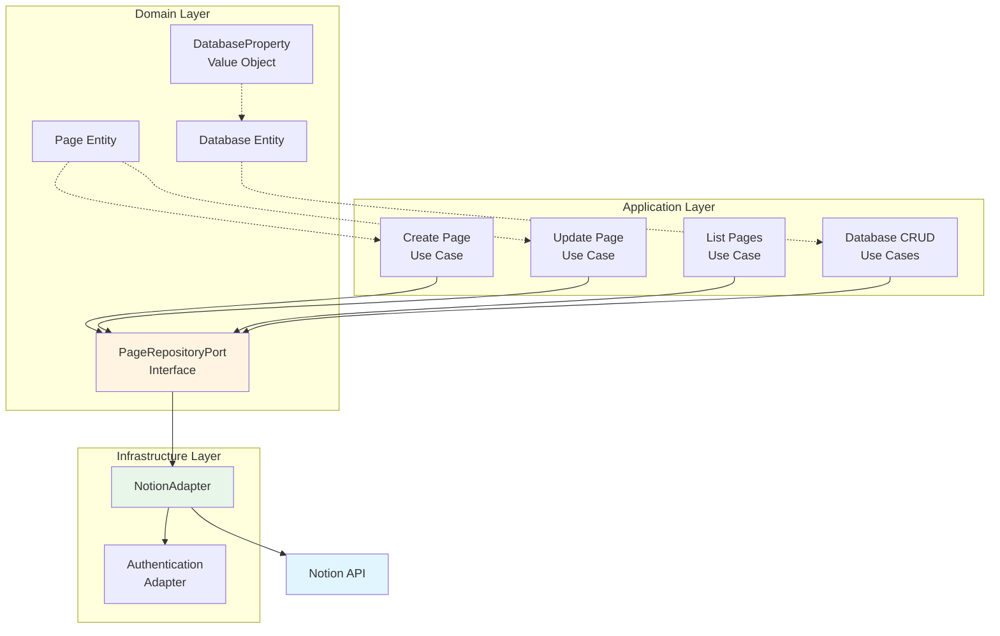

# ParaFlow

AI-powered personal assistant that captures, processes, and organizes your thoughts into the PARA framework using clean hexagonal architecture.

## 🎯 Current Status: Notion API MVP Complete + Database CRUD

The project now features a complete Notion API integration MVP that demonstrates all CRUD operations using hexagonal architecture principles. This implementation serves as the foundation for building the full PARA framework.

**Key Features Implemented:**
- ✅ Complete CRUD operations for Notion pages
- ✅ Complete CRUD operations for Notion databases
- ✅ Database pages support using existing Page operations
- ✅ Hexagonal architecture with ports and adapters
- ✅ Comprehensive test suite (75 total tests: 36 unit tests + 39 integration/contract tests)
- ✅ Authentication and configuration management
- ✅ Error handling and validation
- ✅ Demo script for quick verification

## 🏗️ Architecture Overview

ParaFlow follows hexagonal architecture (ports and adapters pattern) to ensure clean separation of concerns and technology independence:



## 🚀 Quick Start

### 1. Environment Setup

```bash
# Clone the repository
git clone https://github.com/yourusername/ParaFlow.git
cd ParaFlow

# Copy the example environment file
cp .env.example .env

# Edit .env with your Notion credentials
NOTION_TOKEN=your_notion_integration_token
NOTION_DATABASE_ID=your_notion_page_id
```

### 2. Install Dependencies

```bash
# Create virtual environment (recommended)
python -m venv .venv

# Activate virtual environment
source .venv/bin/activate  # On Windows: .venv\Scripts\activate

# Install all dependencies from requirements.txt
pip install -r requirements.txt
```

**Note**: You must use `source .venv/bin/activate` (not just `.venv/bin/activate`) to properly activate the virtual environment.

### 3. Configure Notion Integration

1. **Create Integration**:
   - Go to https://www.notion.so/my-integrations
   - Click "New integration"
   - Name your integration and select workspace
   - Copy the "Internal Integration Token"

2. **Share a Page**:
   - Open any page in Notion
   - Click "Share" → "Invite"
   - Add your integration
   - Copy the page ID from URL

3. **Update .env**:
   ```bash
   NOTION_TOKEN=your_integration_token_here
   NOTION_DATABASE_ID=your_page_id_here  # Note: Despite the name, use a PAGE ID, not database ID
   ```

### 4. Run the Demo

```bash
# Execute the demonstration script
python examples/demo_script.py
```

## 📁 Project Structure

```
ParaFlow/
├── packages/                    # Main application code
│   ├── domain/                  # Business logic (technology-agnostic)
│   │   ├── models/
│   │   │   ├── page.py         # Page domain entity
│   │   │   ├── database.py     # Database entity
│   │   │   ├── database_property.py  # Property schema value object
│   │   │   └── property_types.py     # PropertyType enum
│   │   ├── ports/
│   │   │   └── page_repository.py  # Repository interface
│   │   └── exceptions.py       # Domain-specific exceptions
│   │
│   ├── application/             # Use cases and orchestration
│   │   └── use_cases/
│   │       └── page_operations.py  # CRUD use cases
│   │
│   └── infrastructure/          # External integrations
│       └── adapters/
│           ├── auth.py         # Authentication handling
│           └── notion_adapter.py   # Notion API implementation
│
├── packages/domain/tests/       # Comprehensive test suite
│   ├── unit/                   # Isolated unit tests (36 database tests)
│   ├── integration/            # End-to-end tests (6 scenarios)
│   └── contract/               # API contract tests (4 operations)
│
├── examples/
│   └── demo_script.py          # Complete usage demonstration
│
├── README_NOTION_MVP.md        # Detailed technical documentation
├── .env.example               # Configuration template
└── README.md                  # This file
```

## ⚡ Features

### CRUD Operations

#### Page Operations
- **Create Page**: Create new pages with title and content
- **Read Page**: Retrieve pages by ID with full metadata
- **Update Page**: Modify existing page title and content
- **Delete Page**: Remove pages (archives in Notion)
- **List Pages**: Paginated page listing with search
- **Page Existence**: Check if page exists

#### Database Operations
- **Create Database**: Create databases with typed property schemas
- **Read Database**: Retrieve database schema and metadata
- **Update Database**: Modify database properties and configuration
- **Delete Database**: Archive databases with confirmation
- **Query Database Pages**: Retrieve all pages in a database
- **Database Pages**: Create/update pages in databases using existing Page operations

### Technical Features
- **Hexagonal Architecture**: Clean separation of concerns
- **Async/Await Support**: Full asynchronous operation support
- **Type Safety**: Complete type hints throughout codebase
- **Error Handling**: Comprehensive domain-specific exceptions
- **Input Validation**: Robust validation at all layers
- **Immutable Entities**: Frozen dataclasses for data integrity

### Testing & Quality
- **49 Total Tests**: 38 unit tests + 11 integration tests for comprehensive coverage
- **Integration Tests**: End-to-end validation framework
- **Clean Code**: PEP 8 compliance, docstrings, type hints
- **Architecture Validation**: Proper dependency inversion

## 🧪 Testing

```bash
# Make sure dependencies are installed first
pip install -r requirements.txt

# Run unit tests
python -m pytest tests/unit/ -v

# Run with coverage report
python -m pytest tests/unit/ --cov=packages --cov-report=html

# Run integration tests (requires Notion setup in .env)
python -m pytest tests/integration/ -v
```


## 📖 Usage Examples

### Basic CRUD Operations

```python
import asyncio
from packages.infrastructure.adapters.auth import AuthenticationAdapter
from packages.infrastructure.adapters.notion_adapter import NotionPageRepositoryAdapter
from packages.application.use_cases.page_operations import PageApplicationService

async def example():
    # Initialize services
    auth = AuthenticationAdapter()
    adapter = NotionPageRepositoryAdapter(auth)
    service = PageApplicationService(adapter)
    
    # Create a page
    page = await service.create_page(
        title="My PARA Framework Page",
        content="This page demonstrates the MVP implementation",
        metadata={"category": "projects"}
    )
    
    # Read the page
    retrieved = await service.get_page(page.id)
    
    # Update the page
    updated = await service.update_page(
        page.id,
        title="Updated Title",
        content="Updated content with new information"
    )
    
    # Delete the page
    deleted = await service.delete_page(page.id)

asyncio.run(example())
```

### Database CRUD Operations

```python
from packages.domain.models.database import Database, DatabaseProperty
from packages.domain.models.property_types import PropertyType
from packages.infrastructure.adapters.notion_adapter import NotionAdapter

# Initialize adapter
adapter = NotionAdapter()

# Create a database with structured properties
database = Database(
    title="Task Tracker",
    description="Track project tasks with status and priority",
    properties={
        "Name": DatabaseProperty(
            name="Name",
            property_type=PropertyType.TITLE,
            config={},
            is_required=True
        ),
        "Status": DatabaseProperty(
            name="Status",
            property_type=PropertyType.SELECT,
            config={
                "options": [
                    {"name": "Todo", "color": "red"},
                    {"name": "In Progress", "color": "yellow"},
                    {"name": "Done", "color": "green"}
                ]
            }
        ),
        "Priority": DatabaseProperty(
            name="Priority",
            property_type=PropertyType.NUMBER,
            config={"format": "number"}
        )
    }
)

# Create database
created_db = adapter.create_database(database)
print(f"Database created with ID: {created_db.id}")

# Retrieve database
retrieved_db = adapter.get_database(created_db.id)

# Update database schema (add new property)
updated_db = Database(
    id=created_db.id,
    title=created_db.title,
    description="Updated: Added due date field",
    properties={
        **created_db.properties,
        "Due Date": DatabaseProperty(
            name="Due Date",
            property_type=PropertyType.DATE,
            config={}
        )
    }
)
result_db = adapter.update_database(updated_db)

# Create pages in database using existing Page operations
from packages.domain.models.page import Page

task_page = Page(
    title="Implement authentication",
    content="",
    metadata={
        "parent_database_id": created_db.id,
        "properties": {
            "Status": "In Progress",
            "Priority": 1
        }
    }
)

created_page = adapter.create_page(task_page)

# Query all pages in database
pages = adapter.query_database_pages(created_db.id)
print(f"Found {len(pages)} pages in database")

# Delete database (requires confirmation)
deleted = adapter.delete_database(created_db.id, confirm=True)
```

## 🔧 Configuration

### Environment Variables

| Variable | Required | Description |
|----------|----------|-------------|
| `NOTION_TOKEN` | Yes | Notion integration token from your integration |
| `NOTION_DATABASE_ID` | Yes | ID of a Notion **page** (not database) shared with your integration |
| `ENVIRONMENT` | No | Environment indicator (development/production) |

## 🛣️ Roadmap

### Phase 1: MVP Foundation ✅ COMPLETE
- [x] Notion API integration
- [x] Basic CRUD operations
- [x] Hexagonal architecture implementation
- [x] Comprehensive testing
- [x] Documentation and examples

### Phase 2: PARA Framework Core (Next)
- [ ] PARA domain models (Projects, Areas, Resources, Archives)
- [ ] Classification engine for organizing information
- [ ] PARA methodology workflows
- [ ] Advanced search and filtering

### Phase 3: Multi-Storage Support
- [ ] Excel adapter implementation
- [ ] Google Sheets integration
- [ ] File system adapter
- [ ] Database storage options

### Phase 4: User Interface
- [ ] Command-line interface (CLI)
- [ ] Web-based dashboard
- [ ] API endpoints for external integrations

### Phase 5: AI Enhancement
- [ ] Intelligent content classification
- [ ] Natural language processing
- [ ] Automated organization suggestions
- [ ] Content summarization and insights

## 🤝 Contributing

This project follows clean architecture principles and test-driven development:

1. Keep domain layer technology-agnostic
2. Use ports for all external dependencies
3. Write tests for all new functionality
4. Follow existing patterns and conventions
5. Maintain comprehensive documentation

## 📄 Documentation

- **[Technical Documentation](README_NOTION_MVP.md)**: Detailed architecture and implementation guide
- **[API Documentation](packages/)**: Inline code documentation with docstrings
- **[Demo Script](examples/demo_script.py)**: Complete usage examples
- **[Configuration Guide](.env.example)**: Environment setup instructions

## 📊 Implementation Metrics

- **Architecture**: Hexagonal (Ports & Adapters)
- **Lines of Code**: ~2,500 lines of implementation
- **Test Coverage**: 75 comprehensive tests (36 unit + 39 integration/contract)
- **Database Feature Coverage**: 93% (96/103 statements)
- **Dependencies**: 3 production dependencies (notion-client, pydantic, python-dotenv)
- **Features**: 10 core CRUD operations (6 page + 4 database)
- **Documentation**: Complete with examples and guides

---

**Status**: ✅ Notion API MVP Complete + Database CRUD Production Ready
**Architecture**: ✅ Hexagonal Architecture Compliant
**Tests**: ✅ 75/75 Tests Implemented (Unit + Integration + Contract)
**Next Phase**: PARA Framework Domain Implementation

