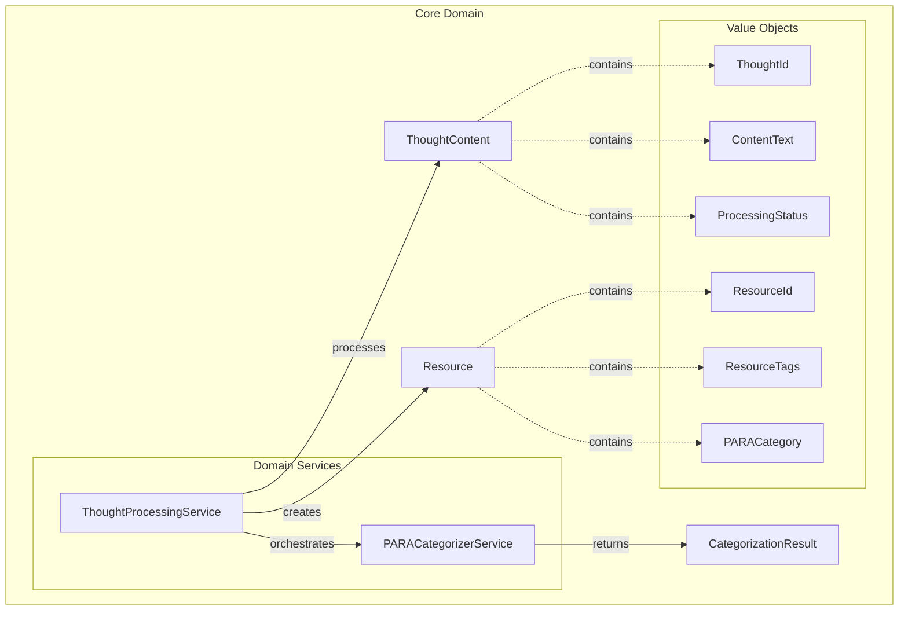

# Code Architecture: Ports and Adapters

ParaFlow follows the **Ports and Adapters architecture** (also known as Hexagonal Architecture) to maintain clean separation of concerns and enable easy extensibility for different platforms and integrations.

This document focuses on the implementation details. For the rationale behind our architectural choices and comparison with alternatives, see [Architecture Decisions](./architecture_decisions.md).

## Current Implementation Status

**✅ Completed: Domain Layer**
- Complete domain model with entities, value objects, and comprehensive business rules
- Domain services for orchestrating complex workflows (ThoughtProcessingService, PARACategorizerService)
- Comprehensive test suite with 100+ tests and high code coverage
- Type-safe implementations using Python 3.12+ native types
- Immutable domain objects with frozen dataclasses
- PARA methodology enforcement and workflow orchestration

**🚧 Next: Infrastructure & Application Layers**
- Domain Events implementation for processing lifecycle events
- Repository patterns for data persistence
- Advanced LLM integration for sophisticated categorization
- API endpoints and controllers
- External adapter implementations

## Architecture Overview

```
┌─────────────────────────────────────────────────────────────┐
│                        Adapters                             │
│  ┌─────────────┐  ┌─────────────┐  ┌─────────────┐         │
│  │   Notion    │  │   Obsidian  │  │   Other     │         │
│  │   Adapter   │  │   Adapter   │  │   Adapters  │         │
│  └─────────────┘  └─────────────┘  └─────────────┘         │
└─────────────────────────────────────────────────────────────┘
                              │
┌─────────────────────────────────────────────────────────────┐
│                         Ports                               │
│  ┌─────────────┐  ┌─────────────┐  ┌─────────────┐         │
│  │  Content    │  │  Webhook    │  │  Storage    │         │
│  │  Port       │  │  Port       │  │  Port       │         │
│  └─────────────┘  └─────────────┘  └─────────────┘         │
└─────────────────────────────────────────────────────────────┘
                              │
┌─────────────────────────────────────────────────────────────┐
│                      Core Domain                            │
│  ┌─────────────┐  ┌─────────────┐  ┌─────────────┐         │
│  │    PARA     │  │ Content     │  │ Organization│         │
│  │ Categorizer │  │ Analyzer    │  │   Engine    │         │
│  └─────────────┘  └─────────────┘  └─────────────┘         │
└─────────────────────────────────────────────────────────────┘
```

## Core Domain

The **Core Domain** contains the business logic and rules that are independent of any external system. This is where the PARA methodology intelligence and workflow orchestration lives.

### Domain Entities:

- **ThoughtContent**: Represents user thoughts with processing lifecycle management
- **Resource**: Organized content within PARA methodology framework  
- **CategorizationResult**: Results from PARA classification with confidence scoring

### Value Objects:

- **ThoughtId/ResourceId**: Type-safe unique identifiers
- **ContentText**: Validated content with rich operations
- **ResourceTags**: Managed tag collections with validation
- **ProcessingStatus**: Lifecycle state management (NEW → PROCESSING → COMPLETED/FAILED)
- **PARACategory**: PARA methodology categories with transition rules

### Domain Services:

- **ThoughtProcessingService**: Orchestrates complete thought-to-resource transformation workflow
- **PARACategorizerService**: Intelligent content classification using PARA methodology
- Content classification and confidence scoring
- PARA transition rules and validation
- Workflow orchestration and error handling
- Processing statistics and health monitoring

### Current Architecture Diagram:



## Ports

**Ports** define the interfaces that the core domain uses to interact with the outside world. They are contracts that adapters must implement.

### Input Ports (Driving):

- **ContentPort**: Interface for receiving content updates and changes
- **WebhookPort**: Interface for receiving webhook notifications
- **CommandPort**: Interface for manual commands and operations

### Output Ports (Driven):

- **StoragePort**: Interface for persisting and retrieving organized content
- **NotificationPort**: Interface for sending notifications about organization changes
- **ExternalSystemPort**: Interface for interacting with external platforms

## Adapters

**Adapters** implement the ports and handle the technical details of integrating with specific external systems.

### Input Adapters (Primary):

- **HTTP Webhook Adapter**: Receives webhooks from external systems
- **REST API Adapter**: Provides HTTP endpoints for manual operations
- **Scheduler Adapter**: Triggers periodic scanning and organization tasks
- **CLI Adapter**: Command-line interface for direct interaction

### Output Adapters (Secondary):

- **Notion Adapter**: Implements ExternalSystemPort for Notion integration
- **Obsidian Adapter**: Implements ExternalSystemPort for Obsidian integration
- **Database Adapter**: Implements StoragePort for data persistence
- **Email Adapter**: Implements NotificationPort for email notifications

## Benefits of This Architecture

1. **Platform Agnostic**: The core domain doesn't know about Notion, Obsidian, or any specific platform
2. **Testability**: Core business logic can be tested independently of external dependencies
3. **Extensibility**: New platforms can be added by implementing the appropriate adapters
4. **Maintainability**: Changes to external systems only affect their respective adapters
5. **Flexibility**: Different combinations of adapters can be used for different deployment scenarios

## Example Flow

1. **Notion Webhook** → **HTTP Webhook Adapter** → **WebhookPort** → **Core Domain**
2. **Core Domain** processes the content using **PARA Categorizer** and **Organization Engine**
3. **Core Domain** → **StoragePort** → **Database Adapter** (saves state)
4. **Core Domain** → **ExternalSystemPort** → **Notion Adapter** (updates Notion)
5. **Core Domain** → **NotificationPort** → **Email Adapter** (notifies user)

## Monorepo Structure

ParaFlow uses an **Apps/Packages** monorepo pattern that complements the hexagonal architecture:

```
├── packages/
│   ├── domain/            # Core Domain (business logic)
│   ├── infrastructure/    # External integrations (planned)
│   └── application/       # Use cases and API layer (planned)
├── docs/                  # Documentation
└── infrastructure/        # Docker, deployment configurations (planned)
```

### Current Package Structure

Following hexagonal architecture principles:

```
packages/domain/               # Core Domain Layer
├── models/                   # Domain entities and value objects
│   ├── thought_content.py    # ThoughtContent entity
│   ├── resource.py           # Resource entity  
│   ├── categorization_result.py # CategorizationResult value object
│   ├── processing_status.py  # ProcessingStatus enum
│   ├── para_category.py      # PARACategory enum
│   ├── content_text.py       # ContentText value object
│   ├── resource_tags.py      # ResourceTags value object
│   ├── thought_id.py         # ThoughtId value object
│   ├── resource_id.py        # ResourceId value object
│   └── __init__.py
├── services/                 # Domain services
│   ├── thought_processing_service.py  # Workflow orchestration
│   ├── para_categorizer_service.py    # PARA categorization
│   └── __init__.py
└── tests/                    # Comprehensive test suite (100+ tests)
    ├── services/             # Service tests
    │   ├── test_thought_processing_service.py
    │   └── test_para_categorizer_service.py
    ├── test_thought_content.py
    ├── test_resource.py
    ├── test_categorization_result.py
    ├── test_processing_status.py
    ├── test_para_category.py
    ├── test_content_text.py
    ├── test_resource_tags.py
    ├── test_thought_id.py
    ├── test_resource_id.py
    └── __init__.py

packages/infrastructure/       # External integrations (planned)
├── repositories/             # Data persistence adapters
├── external/                # External service adapters  
└── events/                  # Event publishing adapters

packages/application/         # Use cases and API layer (planned)
├── use_cases/               # Application use cases
├── controllers/             # API controllers
└── serializers/             # Data serialization
```

### Benefits of This Structure

- **Shared Domain Logic**: Frontend, backend, and CLI all use the same core business logic
- **Type Safety**: Shared types ensure consistency across the entire stack
- **Independent Deployment**: Each app can be deployed separately
- **Code Reuse**: UI components and utilities are shared across applications
- **Maintainability**: Changes to domain logic automatically benefit all applications

For detailed rationale behind this architectural choice, see [Architecture Decisions](./architecture_decisions.md).

This architecture ensures that ParaFlow remains flexible, testable, and easily extensible for any platform or integration that contributors want to add.