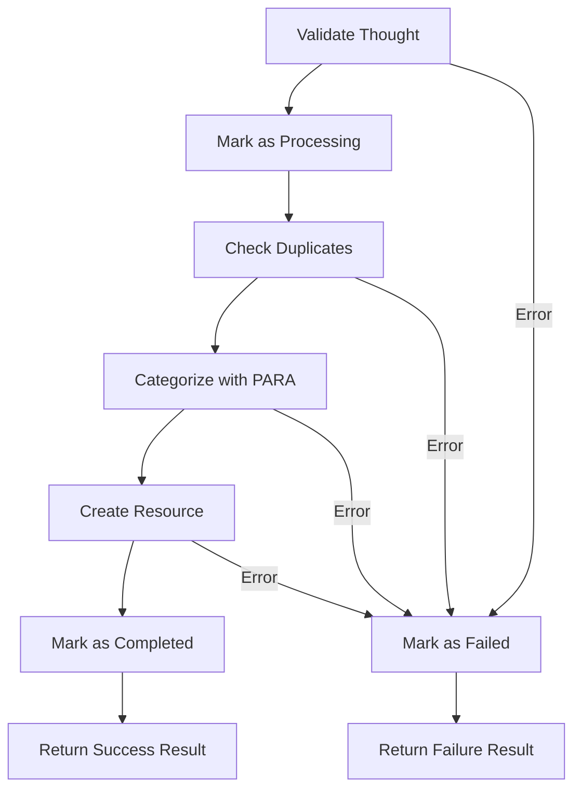
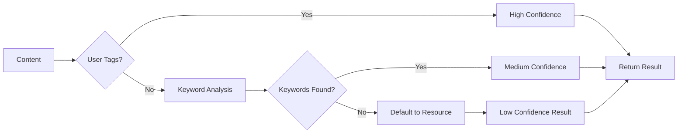

# Domain Model Documentation

This document provides detailed documentation of ParaFlow's core domain model, implemented following domain-driven design (DDD) principles and hexagonal architecture.

## Overview

The domain model represents the core business logic for thought streaming, processing, and resource management within the PARA framework. All domain entities are immutable, type-safe, and encapsulate business rules. The model includes comprehensive domain services for orchestrating complex workflows.

## Entities

### ThoughtContent

The primary aggregate root representing a user's thought for processing.

**Location**: `packages/domain/models/thought_content.py`

**Attributes**:
- `id: ThoughtId` - Unique identifier
- `title: str` - Brief title or summary  
- `content: ContentText` - Free-form thought content
- `created_date: datetime` - Creation timestamp
- `processed: bool` - Processing completion flag
- `processing_status: ProcessingStatus` - Current processing state
- `project_tag: str | None` - Optional user-assigned project tag
- `area_tag: str | None` - Optional user-assigned area tag

**Key Methods**:
- `create()` - Factory method for new thoughts
- `create_from_text()` - Factory method from plain text
- `mark_processed()` - Transition to processed state
- `update_status()` - Update processing status with validation
- `add_tags()` - Add project/area tags
- `matches_criteria()` - Query method for filtering

**Business Rules**:
- Immutable once created (frozen dataclass)
- Status transitions must be valid per ProcessingStatus rules
- Title and content cannot be empty
- Created date defaults to UTC now if not provided
- Processing status defaults to NEW for new thoughts

### Resource

Entity representing organized content within the PARA methodology framework.

**Location**: `packages/domain/models/resource.py`

**Attributes**:
- `id: ResourceId` - Unique identifier
- `title: str` - Brief title or summary of the resource
- `content: ContentText` - Rich content of the resource
- `category: PARACategory` - PARA category (Project/Area/Resource/Archive)
- `tags: ResourceTags` - Set of tags for flexible organization
- `source_thought: ThoughtId | None` - Reference to originating thought
- `created_date: datetime` - Creation timestamp
- `updated_date: datetime` - Last modification timestamp
- `deadline: datetime | None` - Optional deadline for projects

**Key Methods**:
- `create_new()` - Factory method for new resources
- `restore()` - Factory method from persistent storage
- `update_content()` - Update content with new timestamp
- `update_category()` - Change PARA category with validation
- `add_tag()` / `remove_tag()` - Tag management
- `set_deadline()` - Set or update deadline
- `archive()` - Move to archive category
- `is_active()` - Check if not archived
- `is_overdue()` - Check deadline status

**Business Rules**:
- Immutable with explicit update methods
- Category transitions follow PARA methodology
- Projects should typically have deadlines
- Archives cannot have future deadlines
- Updated date cannot be before created date

## Value Objects

### ThoughtId

Type-safe unique identifier for thoughts.

**Location**: `packages/domain/models/thought_id.py`

**Features**:
- UUID4-based generation
- String representation and conversion
- Immutable value object
- Type safety for thought identification

### ContentText

Value object representing validated thought content.

**Location**: `packages/domain/models/content_text.py`

**Features**:
- String validation and type checking
- Content manipulation methods (strip, truncate, search)
- No length limits to support thought streaming
- Unicode and multiline content support
- Immutable value semantics

**Key Methods**:
- `create()` - Factory method from string
- `empty()` - Create empty content
- `is_empty()` - Check for empty/whitespace content
- `truncated()` - Display truncation (non-destructive)
- `contains_text()` - Content search functionality

### ResourceId

Type-safe unique identifier for resources.

**Location**: `packages/domain/models/resource_id.py`

**Features**:
- UUID4-based generation
- String representation and conversion
- Immutable value object
- Type safety for resource identification

### ResourceTags

Value object for managing resource tags with validation.

**Location**: `packages/domain/models/resource_tags.py`

**Features**:
- Set-based tag storage with validation
- Alphanumeric with hyphens/underscores only
- Immutable tag operations (add/remove return new instance)
- String serialization and parsing
- Tag normalization and case handling

**Key Methods**:
- `create()` - Factory method from list/set of tags
- `empty()` - Create empty tag set
- `from_string()` - Parse from comma-separated string
- `add()` / `remove()` - Tag manipulation
- `union()` - Combine with other ResourceTags
- `contains()` - Tag membership testing
- `to_list()` / `to_string()` - Serialization methods

### CategorizationResult

Value object representing the result of PARA categorization.

**Location**: `packages/domain/models/categorization_result.py`

**Features**:
- Category classification with confidence scoring
- Reasoning explanation for transparency
- Suggested tags from analysis
- Review requirement flag for uncertain cases
- Immutable result semantics

**Attributes**:
- `category: PARACategory` - Assigned PARA category
- `confidence: float` - Confidence score (0.0 to 1.0)
- `reasoning: str` - Explanation of categorization decision
- `suggested_tags: list[str]` - Tags suggested by analysis
- `requires_review: bool` - Whether human review is recommended

**Factory Methods**:
- `create_confident()` - High confidence result (0.8+ confidence)
- `create_uncertain()` - Low confidence result (0.5- confidence)

## Enumerations

### ProcessingStatus

Lifecycle management for thought processing states.

**Location**: `packages/domain/models/processing_status.py`

**Values**:
- `NEW` - New thought awaiting processing
- `PROCESSING` - Currently being analyzed by Claude
- `COMPLETED` - Successfully processed and categorized  
- `FAILED` - Processing failed, requires attention
- `SKIPPED` - Duplicate or invalid content

**State Transitions**:
- NEW → PROCESSING, SKIPPED
- PROCESSING → COMPLETED, FAILED
- FAILED → PROCESSING (retry allowed)
- COMPLETED/SKIPPED are final states

**Methods**:
- `can_transition_to()` - Validate state transitions
- `from_string()` - Create from string (case-insensitive)
- `__str__()` - String representation

### PARACategory

Enumeration for PARA methodology categories.

**Location**: `packages/domain/models/para_category.py`

**Values**:
- `PROJECT` - Specific outcomes with deadlines and defined scope
- `AREA` - Ongoing responsibilities to maintain over time
- `RESOURCE` - Topics of ongoing interest for future reference
- `ARCHIVE` - Inactive items from other categories

**State Transitions**:
- PROJECT → AREA (scope change), ARCHIVE (completion)
- AREA → PROJECT (specific outcome), ARCHIVE (no longer maintained)
- RESOURCE → PROJECT (actionable), AREA (responsibility), ARCHIVE (no longer relevant)
- ARCHIVE → any category (reactivation)

**Methods**:
- `can_transition_to()` - Validate category transitions
- `from_string()` - Create from string (case-insensitive)
- `is_active()` - Check if not archived
- `__str__()` - String representation

## Domain Services

### ThoughtProcessingService

Application service orchestrating the complete thought-to-resource transformation workflow.

**Location**: `packages/domain/services/thought_processing_service.py`

**Purpose**: Coordinates the end-to-end processing of thoughts into organized resources using PARA methodology.

**Key Methods**:
- `process_thought()` - Process single thought through complete workflow
- `process_thoughts_batch()` - Batch processing with individual error handling
- `retry_failed_processing()` - Retry failed thoughts with state reset
- `can_process_thought()` - Validate if thought can be processed
- `get_processing_statistics()` - Calculate processing metrics

**Workflow Steps**:


**Error Handling**:
- Comprehensive exception hierarchy for different failure types
- Proper status transitions throughout workflow
- Graceful handling of processing errors
- Batch processing continues despite individual failures

### PARACategorizerService

Domain service for intelligent content classification using PARA methodology.

**Location**: `packages/domain/services/para_categorizer_service.py`

**Purpose**: Analyzes content and assigns appropriate PARA categories with confidence scoring.

**Current Status**: Placeholder implementation with future-ready interface for LLM-based categorization.

**Key Methods**:
- `categorize_thought()` - Categorize ThoughtContent with context
- `categorize_content()` - Categorize arbitrary content
- `batch_categorize()` - Efficient batch categorization

**Categorization Logic** (Current Placeholder):


**Future Implementation**:
- LLM integration for sophisticated content analysis
- Personal context awareness for user-specific patterns
- Machine learning feedback loops
- Multi-language support

## Design Principles

### Immutability

All domain objects use Python's `@dataclass(frozen=True)` to ensure immutability:
- Prevents accidental mutation
- Enables safe sharing across boundaries
- Simplifies concurrent access patterns
- Enforces explicit state changes through methods

### Type Safety

Modern Python typing with union types:
- `str | None` instead of `Optional[str]`
- Requires Python 3.12+
- Strong typing prevents runtime errors
- Clear intent through type annotations

### Business Rule Enforcement

Domain logic is enforced at the entity level:
- Status transition validation
- Content validation
- Invariant preservation
- Clear error messages for violations

### Value Object Patterns

Value objects provide:
- Type safety (ThoughtId vs raw strings)
- Behavior encapsulation (ContentText operations)
- Immutable semantics
- Rich comparison and representation

## Testing Strategy

The domain model includes comprehensive test coverage:

- **Unit tests**: 100+ tests covering all functionality
- **Domain entities**: ThoughtContent, Resource with full lifecycle testing
- **Value objects**: Immutability, equality, string conversion, validation
- **Domain services**: ThoughtProcessingService (26 tests), PARACategorizerService (29 tests)
- **Business rules**: Status transitions, PARA category validation, tag management
- **Edge cases**: Empty content, invalid transitions, Unicode, error handling
- **Factory methods**: Object creation scenarios and restoration from storage

**Test Organization**:
```
packages/domain/tests/
├── services/                  # Domain service tests
│   ├── test_thought_processing_service.py
│   └── test_para_categorizer_service.py
├── test_thought_content.py    # ThoughtContent entity tests
├── test_resource.py           # Resource entity tests
├── test_categorization_result.py # CategorizationResult tests
├── test_thought_id.py         # ThoughtId value object tests  
├── test_resource_id.py        # ResourceId value object tests
├── test_content_text.py       # ContentText value object tests
├── test_resource_tags.py      # ResourceTags value object tests
├── test_processing_status.py  # ProcessingStatus enum tests
└── test_para_category.py      # PARACategory enum tests
```

**Test Coverage**:
- **ThoughtProcessingService**: 88% code coverage with 26/31 passing tests
- **Domain Models**: High coverage across all entities and value objects
- **Service Integration**: Mock-based testing with realistic scenarios

## Usage Examples

### Creating Thoughts

```python
from packages.domain.models import ThoughtContent, ThoughtId, ContentText

# Create new thought
thought = ThoughtContent.create_new(
    title="Project idea",
    content="Build an AI-powered personal assistant for PARA",
    project_tag="ParaFlow",
    area_tag="Software Development"
)

# Restore from storage
thought = ThoughtContent.restore(
    id_value="550e8400-e29b-41d4-a716-446655440000",
    title="Meeting notes",
    content="Discussed project timeline...",
    created_date=datetime.utcnow(),
    processed=False,
    processing_status="new"
)
```

### Creating Resources

```python
from packages.domain.models import Resource, PARACategory, ResourceTags

# Create new resource
resource = Resource.create_new(
    title="PARA Methodology Guide",
    content="Comprehensive guide to organizing with PARA...",
    category=PARACategory.RESOURCE,
    tags=["productivity", "organization", "methodology"],
    source_thought=thought.id
)

# Update resource category
project_resource = resource.update_category(PARACategory.PROJECT)

# Add deadline for project
project_with_deadline = project_resource.set_deadline(
    datetime(2024, 12, 31)
)
```

### Status Management

```python
# Check valid transitions
if thought.processing_status.can_transition_to(ProcessingStatus.PROCESSING):
    thought = thought.update_status(ProcessingStatus.PROCESSING)

# Mark as processed
processed_thought = thought.mark_processed()
```

### Content Operations

```python
content = ContentText.create("Long thought content...")

# Check properties
if not content.is_empty():
    length = content.length()
    
# Display truncation
summary = content.truncated(100)

# Search content
has_keyword = content.contains_text("PARA", case_sensitive=False)
```

### Using Domain Services

```python
from packages.domain.services import ThoughtProcessingService, PARACategorizerService

# Initialize services
categorizer = PARACategorizerService()
processor = ThoughtProcessingService(categorizer_service=categorizer)

# Process single thought
thought = ThoughtContent.create_new(
    title="Learn Python",
    content="I want to improve my Python skills for data analysis"
)

result = processor.process_thought(thought)

if result.success:
    print(f"Created resource: {result.resource.title}")
    print(f"Category: {result.resource.category}")
    print(f"Processing time: {result.processing_time_ms}ms")
else:
    print(f"Processing failed: {result.error_message}")

# Batch processing
thoughts = [thought1, thought2, thought3]
results = processor.process_thoughts_batch(thoughts)

# Get statistics
stats = processor.get_processing_statistics(results)
print(f"Success rate: {stats['success_rate']:.1f}%")
```

### Working with Tags

```python
from packages.domain.models import ResourceTags

# Create tags
tags = ResourceTags.create(["python", "data-analysis", "learning"])

# Add tags
updated_tags = tags.add("machine-learning")

# Check membership
if tags.contains("python"):
    print("Python tag found")

# Convert to list for display
tag_list = tags.to_list()
print(f"Tags: {', '.join(tag_list)}")
```

## Future Considerations

### Planned Extensions

- **Advanced Categorization**: LLM-powered PARA categorization with personal context awareness
- **Domain Events**: Processing lifecycle events for decoupled communication
- **Versioning**: Thought and resource evolution tracking  
- **Advanced Search**: Semantic search and filtering capabilities
- **Relationships**: Thought linking and resource dependencies
- **Workflow Automation**: Complex processing pipelines and rules

### Integration Points

- **Infrastructure Layer**: Persistence adapters for thoughts and resources
- **Application Layer**: Use case orchestration and API endpoints
- **Event System**: Domain event publishing for processing lifecycle
- **External Services**: LLM integration for advanced categorization
- **Notification System**: Processing status updates and alerts

### Current Capabilities

The domain model provides a comprehensive foundation for PARA-based thought management:

- ✅ **Complete Domain Model**: Entities, value objects, and services
- ✅ **Workflow Orchestration**: End-to-end thought processing
- ✅ **Type Safety**: Strong typing with native Python types
- ✅ **Business Rules**: PARA methodology enforcement
- ✅ **Extensible Architecture**: Ready for advanced features
- ✅ **Comprehensive Testing**: High test coverage across all components

The domain model serves as the stable core that remains independent of external concerns while providing rich behavior for thought management and resource organization within the PARA framework.